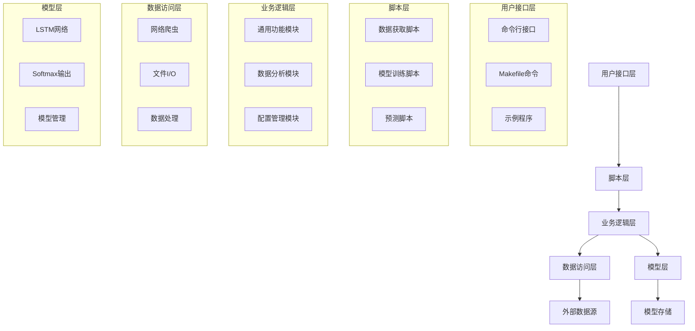
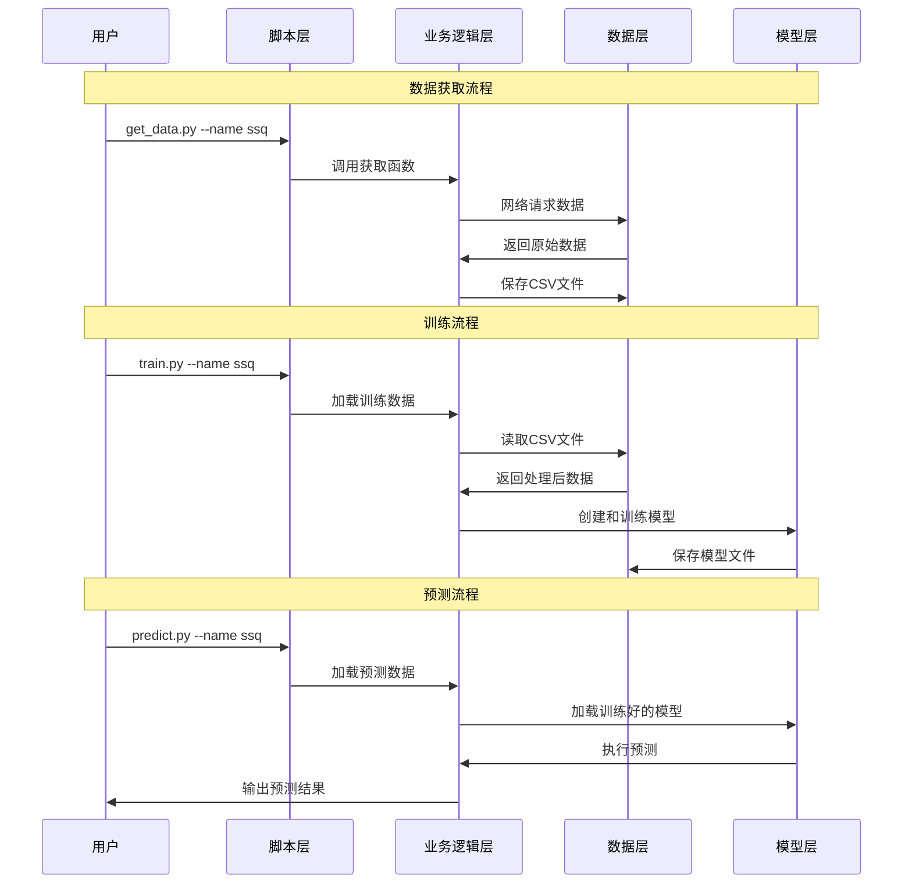
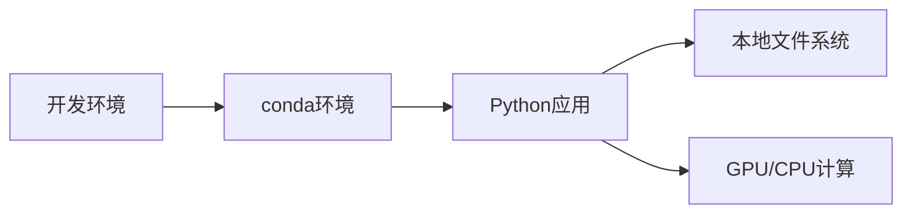
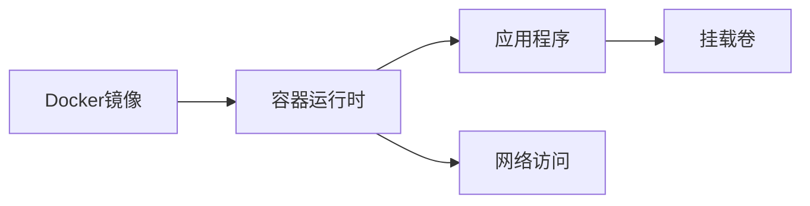
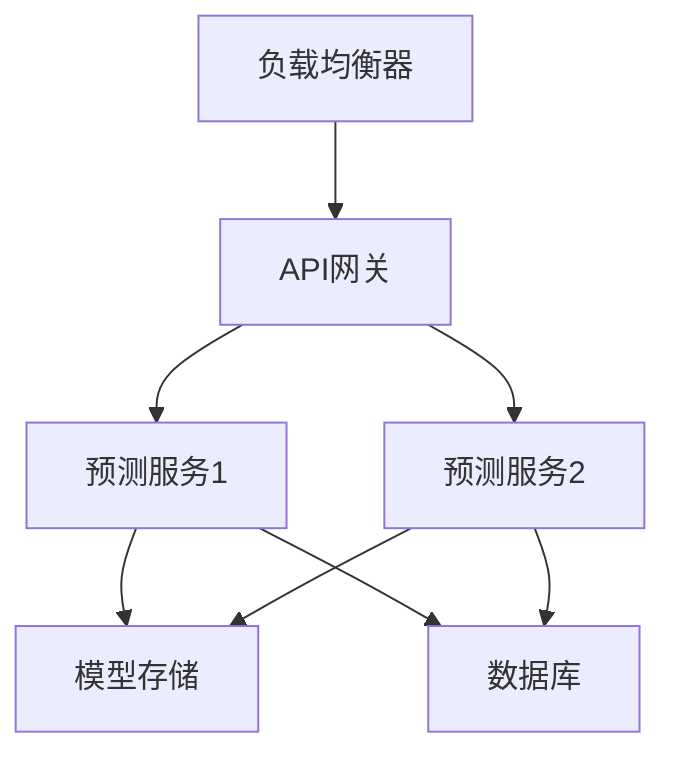

# 系统架构文档

## 概述

彩票AI预测系统是一个基于深度学习的彩票号码预测系统，采用模块化设计，支持多种彩票类型的数据获取、模型训练和预测分析。

## 系统架构图

## 模块设计

### 1. 核心模块 (src/)

#### config.py - 配置管理
- 统一读取 `config.yaml`
- 定义 `SequenceModelSpec` / `LotteryModelConfig`
- 输出 `PATHS`, `LOTTERY_CONFIGS`, 兼容 `name_path`

#### data_fetcher.py - 数据抓取
- 带重试的 HTTP 会话管理
- 历史数据下载与解析（KL8已迁移至独立项目）
- 本地 CSV 装载

#### preprocessing.py - 数据预处理
- 窗口序列构建
- 一致的零基偏移处理
- 训练/验证集拆分

#### modeling.py - 模型定义
- 多层 LSTM 序列模型
- Softmax 输出层生成逐位置概率
- Keras 编译与优化器配置

#### pipeline.py - 训练与预测流程
- 训练循环、回调与模型持久化
- 预测流程包装
- 元数据记录

#### common.py - 高层接口
- 对脚本层提供 download/train/predict API
- 保持旧函数名兼容

#### analysis.py - 辅助分析工具
- 基础统计分析
- 数据可视化与缩水策略

### 2. 脚本层 (scripts/)

#### get_data.py - 数据获取
- 从网络爬取历史数据（KL8相关功能已迁移）
- 数据清洗和验证
- 文件存储

#### train.py - 模型训练
- 数据预处理
- 模型训练流程
- 模型保存

#### predict.py - 预测
- 模型加载
- 预测计算
- 结果输出

### 3. 测试模块 (tests/)
- 单元测试
- 集成测试
- 性能测试

## 数据流

## 技术选型

### 深度学习框架
- **TensorFlow 2.15.1**: 主要框架，官方提供 Windows/Linux/macOS 轮子
- **Keras 2.15 (tf.keras)**: 构建与保存 `.keras` 模型

### 数据处理
- **Pandas**: 数据操作和分析
- **NumPy**: 数值计算
- **BeautifulSoup**: HTML解析
- **Requests**: HTTP请求

### 开发工具
- **Black**: 代码格式化
- **Ruff + mypy**: 统一静态检查
- **Pytest + pytest-cov**: 单元测试与覆盖率
- **Docker**: 容器化部署

## 部署架构

### 单机部署

### 容器化部署

### 分布式部署 (未来规划)

## 性能特征

### 系统容量
- **数据量**: 每个彩票类型约10-50MB历史数据（KL8数据量更大，已迁移至独立项目）
- **内存使用**: 峰值约1-2GB (包含模型)
- **存储需求**: 约100MB-1GB (包含模型文件)
## 玩法迁移与预测修正说明

- 2025-10：KL8（快乐8）相关源码、数据、分析与脚本已迁移至独立项目 [KL8-Lottery-Analyzer](https://github.com/KittenCN/kl8-lottery-analyzer)。本仓库仅支持双色球、大乐透、排列三、七星彩、福彩3D等玩法。
- 2024-06：修正了红球预测逻辑，确保每注红球号码唯一，彻底避免重复。

### 性能指标
- **数据获取**: ~10-30秒 (网络状况依赖)
- **模型训练**: 1-10分钟 (参数和硬件依赖)
- **预测计算**: <1秒
- **并发支持**: 单进程 (可扩展为多进程)

## 安全考虑

### 数据安全
- 仅访问公开的彩票数据
- 不存储敏感用户信息
- 文件操作限制在项目目录

### 网络安全
- HTTPS请求
- 请求超时和重试机制
- 异常处理

### 代码安全
- 输入验证
- 路径遍历防护
- 依赖漏洞扫描

## 监控和日志

### 日志系统
- 使用 Loguru 进行结构化日志
- 分级别记录 (INFO, WARNING, ERROR)
- 文件和控制台双输出

### 监控指标
- 训练损失和准确率
- 预测结果统计
- 系统资源使用情况
- 错误率和异常情况

## 扩展点

### 水平扩展
- 多进程并行训练
- 分布式计算支持
- 微服务架构

### 功能扩展
- Web界面
- 实时预测API
- 移动应用支持
- 更多彩票类型

### 性能优化
- 模型量化
- 缓存机制
- 异步处理
- GPU集群支持
